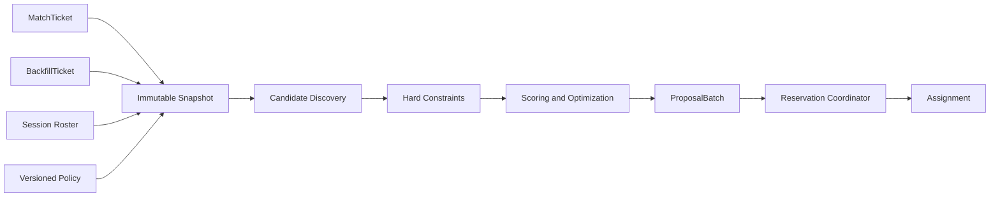

# Sema Architecture

## Intent

Sema는 주어진 수요 집합에서 유효한 조합을 탐색하고, hard constraint를 만족하면서 time-dependent soft objective를 최적화한다. 한 cycle은 ticket이 서로 겹치지 않는 여러 match를 `ProposalBatch`로 반환하며, 검색 결과를 실제 세션 배치로 확정하는 side effect는 coordinator가 담당한다.

## Core Model

- `MatchTicket`: 한 플레이어 또는 함께 움직여야 하는 파티가 새 세션을 찾는 요청. `ticketID`와 `revision`으로 freshness를 식별한다.
- `BackfillTicket`: 이미 존재하는 세션이 roster와 open slot을 제시하며 추가 플레이어를 찾는 요청. 자체 `ticketID`와 `revision`, 대상 `sessionID`와 `rosterVersion`을 고정한다.
- `MatchmakingSnapshot`: 탐색 한 번에 사용된 tickets, session state, policy version의 immutable view.
- `ProposalBatch`: 같은 snapshot에서 생성한 서로 ticket이 겹치지 않는 ordered `MatchProposal` 집합과 unmatched ticket 목록.
- `MatchProposal`: 선택된 tickets, team/slot 배치, score breakdown, policy version, 입력 revision, evidence를 포함한 비확정 결과.
- `Reservation`: proposal의 revision을 검증한 뒤 `reservationID`, `proposalID`, `expiresAt`에 묶어 배타적으로 확보한 상태.
- `Assignment`: reservation이 검증된 뒤 소비자가 실행할 수 있도록 확정된 배치.

## Objective Schedule

- 초기 대기 구간은 skill balance와 role composition 품질을 우선한다.
- 대기 시간이 늘어나면 wait time의 가중치를 올리고 skill/role 허용 범위를 단계적으로 넓힌다.
- `PrioritizeWait` 단계에 들어간 feasible demand는 backfill priority tier 안에서 oldest-first service ordering을 적용해 새 demand에 영구히 밀리지 않게 한다.
- 확장된 후보 안에서는 network latency가 낮은 조합을 우선하며 absolute cap을 넘는 후보는 항상 제외한다.
- party integrity와 session capacity는 완화하지 않는 hard constraint다.

## Boundaries

- `discovery`는 검색 공간을 줄이되 유효 후보를 임의로 확정하지 않는다.
- 초기 discovery는 canonical queue의 oldest fitting ticket prefix를 선택하며 opt-in window truncation을 policy identity와 proposal evidence에 남긴다.
- reusable discovery index는 party size와 skill/role/latency partition을 유지하지만 partition head를 canonical age order로 merge해 linear oldest-prefix와 같은 window를 반환한다. index mutation/lifetime은 stateful queue owner가 담당한다.
- `constraints`는 위반 시 후보를 제거하는 boolean contract를 제공한다.
- `scoring`은 유효 후보를 비교할 objective vector와 explanation을 제공한다.
- roster-aware backfill scoring은 `rosterVersion`에 묶인 team aggregate와 incoming placement의 resulting skill/role/latency를 평가하며 vacancy-only input은 legacy mode로 명시한다.
- `optimizer`는 admissible candidate graph에서 mutually disjoint proposal set을 선택한다. backfill 수, oldest wait-priority service를 먼저 보존한 뒤 일반 bounded path는 총 rank utility를 최적화하고, candidate budget을 생략한 small-queue path는 같은 coverage tier에서 wait/role/skill/latency Pareto dominance로 dominated rank-sum 결과를 repair한다. `MaxProposals`는 상한이다.
- `policy catalog`는 process lifetime에서 version을 하나의 canonical fingerprint와 defensive rule copy에 묶는다.
- `simulation`은 immutable scenario corpus에서 여러 registered policy를 planner로만 평가하고 canonical report를 만든다.
- `coordinator`만 reservation과 assignment 상태를 변경하고 revision을 compare-and-swap으로 검증한다.
- coordinator는 active match ticket의 player ownership index를 함께 갱신해 한 player가 둘 이상의 active ticket에 속하지 않게 한다.
- `adapters`는 API, queue, database, telemetry를 연결하지만 domain decision을 소유하지 않는다.
- public `alpha` package는 immutable composition input/output을 internal model과 명시적으로 변환하고 planner만 호출한다. coordinator lifecycle과 internal type은 노출하지 않는다.
- `internal/durable`은 coordinator mutation과 plan decision을 한 writer에서 직렬화하고 synced journal을 restart recovery와 audit authority로 사용한다.
- `cmd/sema-server`는 explicit `v0alpha1` DTO를 변환하고 server clock과 durable proposal lookup을 사용한다. client placement는 reserve authority가 아니다.
- `internal/observability`은 route-pattern metric/trace와 redacted audit만 노출하고 resource identity를 label/span으로 사용하지 않는다.
- `internal/repository`는 tenant-scoped resource storage version, atomic CAS mutation, operation receipt와 redacted audit의 adapter-neutral contract를 소유한다.
- `internal/service`는 repository-versioned immutable planning input과 target resource kind를 소유한다. candidate index는 같은 repository version에서만 사용할 수 있는 derived state다.

## Invariants

1. 하나의 ticket은 한 `ProposalBatch`에서 최대 하나의 proposal에만 속한다.
2. 하나의 ticket은 동시에 둘 이상의 active reservation에 속하지 않는다.
3. hard constraint 위반 proposal은 score와 관계없이 반환하지 않는다.
4. 같은 snapshot, policy, seed, budget은 같은 ordered proposal batch를 만든다.
5. proposal은 사용한 policy version과 canonical fingerprint, ticket revision, roster version, score evidence를 포함한다.
6. reservation과 assignment mutation은 idempotency key를 요구한다.
7. reserve/commit 시 현재 revision이 다르면 전체 mutation을 적용하지 않고 `StaleSnapshot`을 반환한다.
8. proposal identity는 snapshot, policy fingerprint와 canonical placement가 같을 때만 같다.
9. engine planning은 catalog에 등록된 exact policy version만 사용한다.

## Initial Consistency Model

- P0의 `Coordinator`가 reservation authority이며 planner는 외부 상태를 변경하지 않는다.
- reservation은 opaque `reservationID`를 confirm/cancel token으로 사용하고 fixed TTL을 적용하며 P0에서는 별도 lease owner나 renewal을 지원하지 않는다.
- raw `internal/engine`에서는 프로세스 내부 상태가 source of truth이고 restart 뒤 producer replay가 필요하다.
- P9 service runtime에서는 `sema-journal-v1`이 source of truth이며 startup replay가 active reservation과 assignment를 복구한다.
- 첫 integration은 same-process `internal/engine` direct call이며 idempotency scope와 assignment read model은 process lifetime에 한정된다.
- 외부 import baseline은 `alpha.Compose`의 side-effect-free composition에 한정되며 JSON tag는 production wire contract가 아니다.
- durable journal은 fixed reservation TTL과 Darwin/Linux single-writer file lock을 요구하며 horizontal authority는 제공하지 않는다.
- 별도 consumer process는 HTTP로 분리하지만 planner, coordinator와 journal writer는 같은 deployable에 둔다.

## Productization Consistency Target

- 한 service command의 resource mutation, idempotency receipt와 audit receipt는 하나의 atomic commit이다.
- resource storage version은 domain ticket/roster revision과 별개이며 concurrent update를 CAS한다.
- planning snapshot capture 뒤 matcher search 중에는 storage transaction을 열어 두지 않는다. immutable snapshot과 proposal record는 audit authority로 남고 reserve는 현재 resource freshness를 다시 검증한다.
- related ticket/backfill/reservation/assignment mutation만 같은 transaction에 묶고 unrelated ingress는 진행할 수 있다.
- candidate index는 repository commit version을 따라가거나 snapshot에서 rebuild한다. version mismatch에서는 index result를 사용하지 않는다.
- current journal은 V0 reference/import source다. PostgreSQL primary가 target durable write authority이고 service는 stateless replica로 확장한다. Redis는 baseline에 없으며 candidate index는 PostgreSQL snapshot version에서 rebuild 가능한 derived state다. runtime cutover는 authenticated target API와 import fixture 뒤 수행한다.

## Failure Model

- 탐색 budget 소진은 오류가 아니라 best-known `ProposalBatch` 또는 명시적 no-match 결과다.
- stale snapshot과 reservation conflict는 재탐색 가능한 typed outcome이다.
- batch reservation 도중 하나라도 충돌하면 해당 proposal에는 부분 reservation을 남기지 않는다.
- policy evaluation failure는 해당 policy version의 proposal 생성을 중단하고 관측 가능한 원인으로 노출한다.

## Initial Non-goals

- planner와 coordinator를 별도 process로 배포하지 않는다.
- multi-replica durable writer와 distributed coordination을 제공하지 않는다.
- allocation server hosting, game server lifecycle, identity/auth 전체를 소유하지 않는다.
- 모든 게임에 공통인 단일 quality formula를 제공하지 않는다.
- production snapshot 전체의 모든 feasible placement를 열거한 global optimum은 보장하지 않는다. P23/P24의 명시된 small synthetic boundary와 일반 bounded candidate graph를 구분하고, exact/best-feasible selection과 generation approximation을 evidence로 남긴다.
