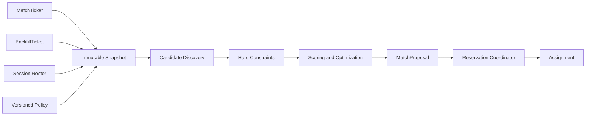

# Sema Architecture

## Intent

Sema는 주어진 수요 집합에서 유효한 조합을 탐색하고, hard constraint를 만족하면서 soft objective를 최적화한 match proposal을 만든다. 검색 결과를 실제 세션 배치로 확정하는 side effect는 별도 coordinator가 담당한다.

## Core Model

- `MatchTicket`: 한 플레이어 또는 함께 움직여야 하는 파티가 새 세션을 찾는 요청.
- `BackfillTicket`: 이미 존재하는 세션이 roster와 open slot을 제시하며 추가 플레이어를 찾는 요청.
- `MatchmakingSnapshot`: 탐색 한 번에 사용된 tickets, session state, policy version의 immutable view.
- `MatchProposal`: 선택된 tickets, team/slot 배치, score breakdown, policy version, evidence를 포함한 비확정 결과.
- `Reservation`: proposal에 포함된 자원을 제한 시간 동안 배타적으로 확보한 상태.
- `Assignment`: reservation이 검증된 뒤 소비자가 실행할 수 있도록 확정된 배치.

## Boundaries

- `discovery`는 검색 공간을 줄이되 유효 후보를 임의로 확정하지 않는다.
- `constraints`는 위반 시 후보를 제거하는 boolean contract를 제공한다.
- `scoring`은 유효 후보를 비교할 objective vector와 explanation을 제공한다.
- `optimizer`는 시간·후보 수 budget 안에서 하나 이상의 proposal을 반환한다.
- `coordinator`만 reservation과 assignment 상태를 변경한다.
- `adapters`는 API, queue, database, telemetry를 연결하지만 domain decision을 소유하지 않는다.

## Invariants

1. 하나의 ticket은 동시에 둘 이상의 active reservation에 속하지 않는다.
2. hard constraint 위반 proposal은 score와 관계없이 반환하지 않는다.
3. 같은 snapshot, policy, seed, budget은 같은 ordered proposal을 만든다.
4. proposal은 사용한 policy version과 score evidence를 포함한다.
5. reservation과 assignment mutation은 idempotency key를 요구한다.
6. stale session roster로 만든 backfill proposal은 commit 전에 거부한다.

## Failure Model

- 탐색 budget 소진은 오류가 아니라 best-known proposal 또는 명시적 no-match 결과다.
- stale snapshot과 reservation conflict는 재탐색 가능한 typed outcome이다.
- persistence timeout은 성공으로 추정하지 않으며 idempotent read-after-write로 상태를 판정한다.
- policy evaluation failure는 해당 policy version의 proposal 생성을 중단하고 관측 가능한 원인으로 노출한다.

## Initial Non-goals

- 구현 언어와 storage engine을 architecture 문서만으로 확정하지 않는다.
- allocation server hosting, game server lifecycle, identity/auth 전체를 소유하지 않는다.
- 모든 게임에 공통인 단일 quality formula를 제공하지 않는다.
- 처음부터 global optimum을 보장하지 않는다. budget과 approximation contract를 명시한다.
