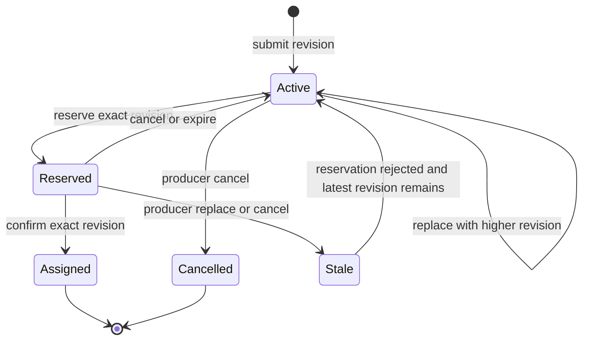
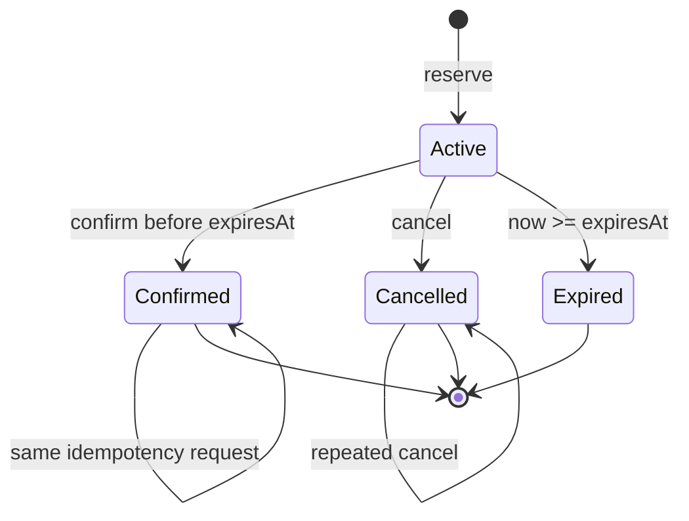
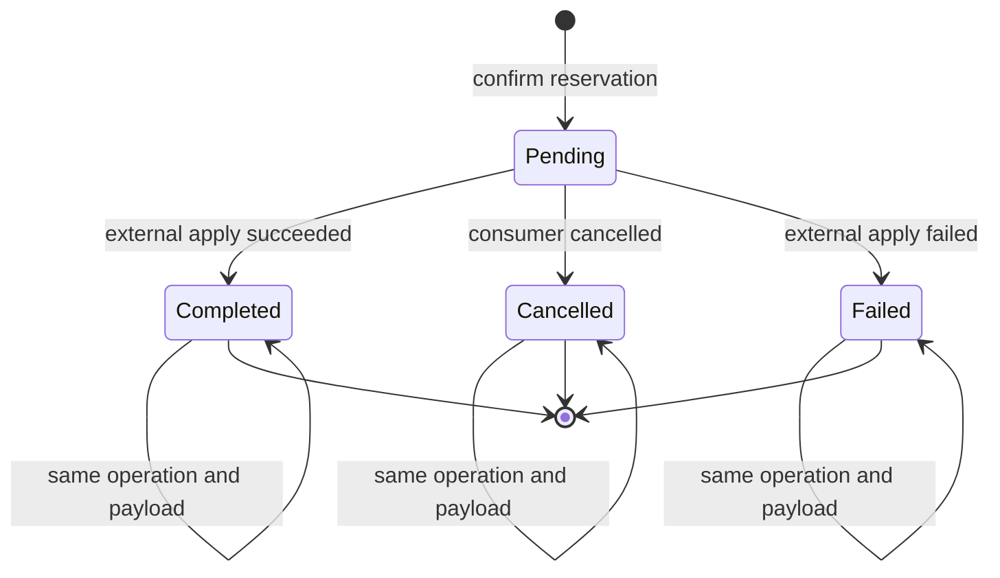

# Lifecycle

## Separation Of Responsibilities

planner는 immutable snapshot을 읽고 `ProposalBatch`만 계산한다. coordinator는 active input, reservation, assignment를 소유하며 planner의 결과를 검증한 뒤에만 side effect를 적용한다.

## Ticket Lifecycle

- 같은 revision과 같은 payload의 재제출은 idempotent하다.
- 더 낮은 revision 또는 같은 revision의 다른 payload는 `InvalidRevision`이다.
- producer가 reserved revision을 교체하거나 취소할 수는 있지만 confirm의 CAS가 실패한다. 실패한 reservation은 해제되고 최신 active state는 유지된다.
- `BackfillTicket`은 자체 revision 외에 target `rosterVersion`도 같은 규칙으로 검증한다.

## Planning Lifecycle

1. coordinator 또는 adapter가 reservation되지 않은 active input과 versioned policy로 immutable snapshot을 만든다.
2. planner가 입력 유효성, hard latency cap, party capacity를 검증한다.
3. backfill 수요를 deterministic order로 먼저 채운다.
4. 남은 `MatchTicket`으로 새 match를 반복 구성한다.
5. search budget을 소진하면 이미 찾은 proposal과 unmatched 목록을 반환하고 `budgetExhausted=true`를 기록한다.
6. 동일 snapshot과 policy는 동일 proposal ID, team ordering, unmatched ordering을 만든다.

proposal은 저장된 권리가 아니다. reserve 이전에 입력이 바뀌면 정상적으로 stale 결과가 될 수 있다.

## Reservation Lifecycle

### Reserve

- coordinator는 proposal의 모든 `MatchTicket` revision과 optional `BackfillTicket` revision/roster version을 한 번에 검증한다.
- 하나라도 stale이거나 다른 active reservation이 소유하면 아무 resource도 확보하지 않는다.
- 성공하면 모든 resource를 `reservationID`에 원자적으로 연결하고 fixed TTL을 설정한다.
- 같은 `reservationID`와 같은 proposal의 반복 호출은 기존 reservation을 반환한다. 다른 payload 재사용은 `IdempotencyConflict`다.

### Confirm

- coordinator는 expiry와 모든 revision을 다시 CAS 검증한다.
- 성공하면 하나의 immutable assignment를 만들고 사용한 active ticket/backfill 수요를 소비한다.
- 같은 `assignmentID`로 반복 confirm하면 기존 assignment를 반환한다.
- 다른 assignment ID로 같은 reservation을 confirm하면 `IdempotencyConflict`다.
- stale이면 부분 assignment를 만들지 않고 reservation을 해제한다.

### Cancel And Expire

- active reservation의 cancel은 resource를 즉시 active pool로 되돌린다.
- TTL은 `now >= expiresAt`에서 만료된다. P0에는 renew가 없다.
- expiry 정리는 reserve, confirm, snapshot 같은 coordinator 진입점에서 lazy하게 수행할 수 있다.

## Typed Failures

| Code | Meaning | Retry behavior |
|---|---|---|
| `InvalidInput` | entity, policy, proposal shape가 유효하지 않음 | 입력 수정 후 재시도 |
| `InvalidRevision` | 제출 revision이 현재 값보다 낮거나 같은 revision의 payload가 다름 | 최신 revision으로 수정 |
| `StaleSnapshot` | reserve/confirm 시 active revision 또는 roster version이 proposal과 다름 | 새 snapshot으로 re-plan |
| `ReservationConflict` | 다른 active reservation이 resource를 소유함 | backoff 후 re-plan |
| `ReservationExpired` | confirm 전에 TTL이 끝남 | re-plan 후 새 reservation |
| `InvalidTransition` | confirmed/cancelled 상태에서 허용되지 않은 전이 | 호출 흐름 수정 |
| `IdempotencyConflict` | 같은 idempotency ID를 다른 payload에 재사용함 | 새 ID 또는 원 요청 사용 |

## P0 Recovery Boundary

프로세스가 재시작되면 active input, reservation, assignment를 복구하지 않는다. producer가 active ticket과 session snapshot을 다시 제출한다. durable recovery와 delivery guarantee는 persistence milestone에서 별도 source of truth와 함께 설계한다.

## Assignment Acknowledgment Lifecycle

- terminal acknowledgment는 opaque `operationID`에 묶이며 같은 ID와 payload의 반복만 허용한다.
- new match completion은 roster detail을 요구하지 않는다.
- backfill completion은 assignment의 `sessionID`와 expected `rosterVersion`을 정확히 반복하고 더 높은 resulting version을 기록한다.
- session authority가 더 최신 roster를 관측하면 같은 version evidence와 `StaleSnapshot` failure를 terminal outcome으로 기록할 수 있다.
- terminal assignment는 다른 operation으로 전이하지 않는다. 취소와 실패도 과거 ticket을 되살리지 않는다.
